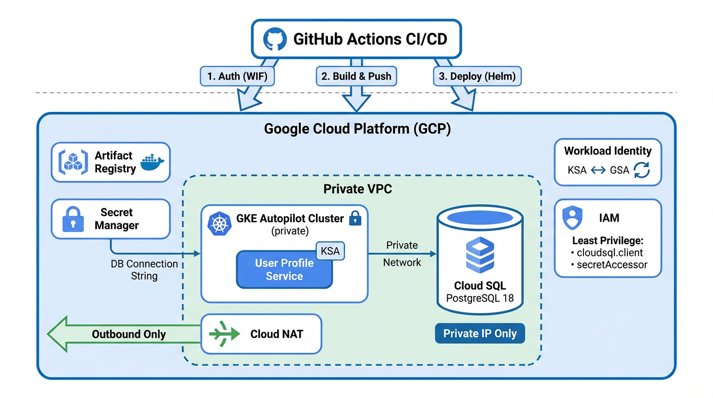

# GCP Authentication/User Profile Microservice

Design, provision, secure, and automate the deployment of a simulated Authentication/User Profile Microservice on Google Cloud Platform using GitHub Actions for CI/CD.

## Architecture Overview



## Project Structure

```
├── terraform/              # Part 1: Infrastructure as Code
│   ├── modules/
│   │   ├── networking/     # VPC, subnets, NAT, firewall
│   │   ├── gke/            # GKE Autopilot cluster
│   │   └── cloudsql/       # Cloud SQL PostgreSQL
│   ├── main.tf             # Root module composition
│   ├── variables.tf        # Input variables
│   ├── outputs.tf          # Output values
│   └── providers.tf        # Provider configuration
├── app/                    # Part 2: Application
│   └── Dockerfile          # Multi-stage secure container
├── helm/                   # Part 2: Helm chart
│   └── user-profile/       # Deployment + Service manifests
├── .github/workflows/      # Part 2: CI/CD pipeline
│   └── ci-cd.yml           # Multi-stage GitHub Actions
└── docs/
    └── analysis.md         # Design & security analysis
```

## Prerequisites

- GCP Project with billing enabled
- `gcloud` CLI authenticated
- Terraform >= 1.14
- Helm >= 3.x
- `kubectl` configured

## Quick Start

```bash
# 1. Clone and configure
cp terraform/terraform.tfvars.example terraform/terraform.tfvars
# Edit terraform.tfvars with your project values

# 2. Provision infrastructure
cd terraform
terraform init
terraform plan
terraform apply

# 3. Configure kubectl
gcloud container clusters get-credentials <cluster-name> --region <region>

# 4. Deploy application
helm install user-profile helm/user-profile -f helm/user-profile/values.yaml
```

## Security Features

- **Private GKE Autopilot** - no public node IPs, master authorized networks
- **Private Cloud SQL** - accessible only via VPC internal IP
- **Workload Identity** - keyless pod-to-GCP authentication
- **Secret Manager** - database credentials never in manifests or logs
- **Least-Privilege IAM** - dedicated service accounts with minimal roles
- **Artifact Registry** - private container image storage
